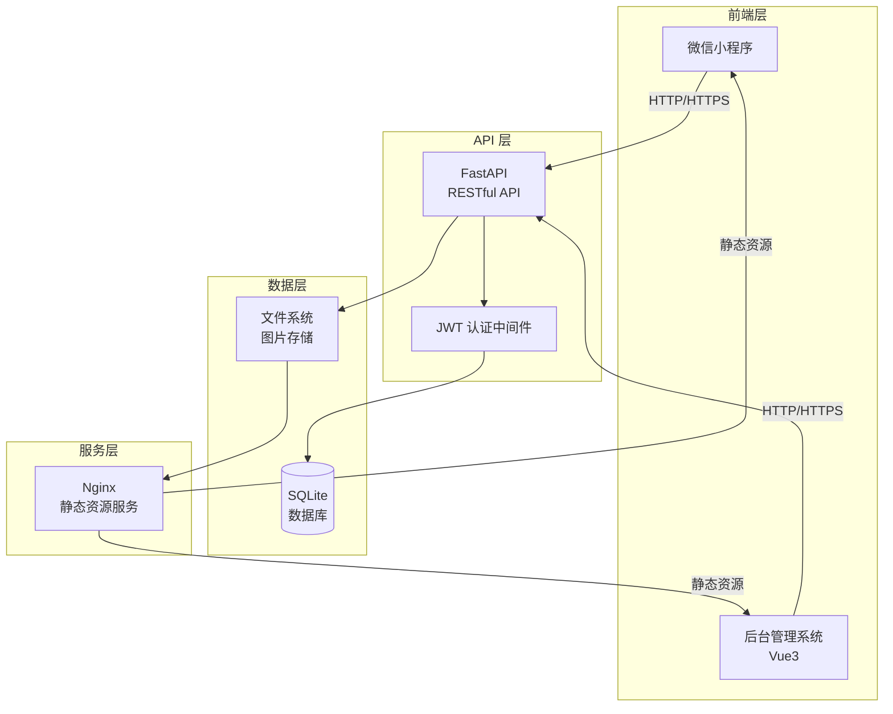
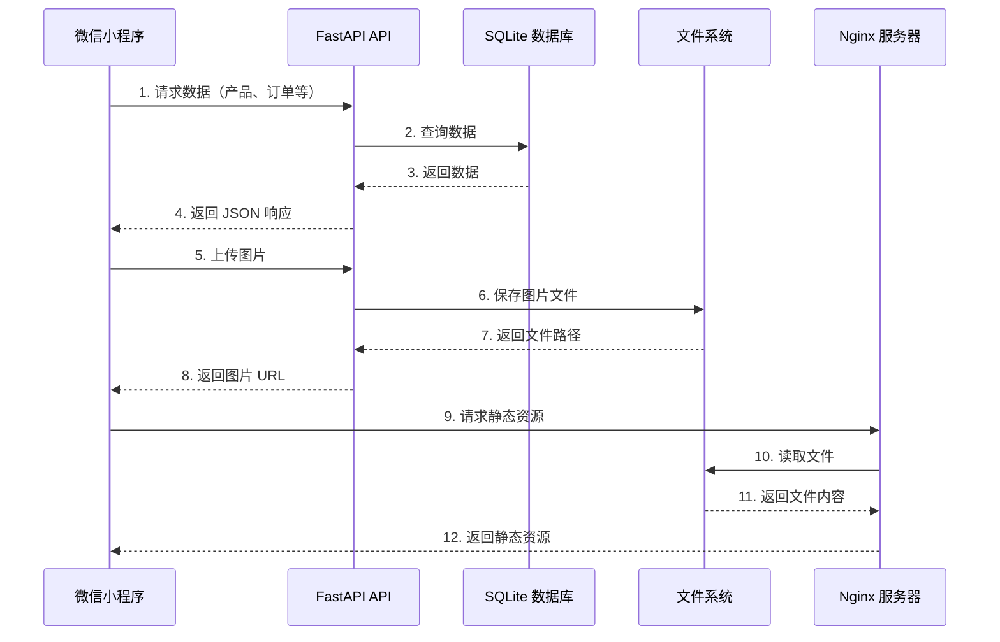

# 咖啡点单微信小程序项目

## 项目概述

本项目是一个前后端分离的咖啡点单微信小程序系统，旨在为咖啡店提供便捷的在线点单服务。系统采用现代化的技术栈，提供流畅的用户体验和高效的后台管理功能。

项目采用前后端分离架构，前端包括微信小程序客户端和基于 Vue3 的后台管理系统，后端使用 FastAPI 提供 RESTful API 服务。整个系统通过 Docker 容器化部署，确保环境一致性和易于扩展。

## 功能蓝图

### 微信小程序端

1. **首页轮播**：展示精美的咖啡图片轮播，吸引用户关注
2. **点单页面**：包含咖啡分类导航和具体产品列表，支持产品浏览和选择
3. **购物车功能**：用户可将选定的咖啡产品添加至购物车，支持数量调整和删除
4. **订单确认**：从购物车跳转至确认订单页面，展示订单详情并支持提交
5. **历史订单**：在"我的"页面浏览历史订单记录，查看订单状态和详情
6. **用户登录**：支持微信授权登录，获取用户基本信息（2.0 版本）

### 后台管理系统（2.0 版本）

1. **内容管理**：对首页轮播图片、咖啡分类、咖啡产品进行完整的增删改查（CRUD）操作
2. **订单管理**：查看和处理不同用户的订单列表，支持订单状态更新和详情查看

## 技术蓝图

### 前端技术栈

- **微信小程序**：使用微信小程序原生开发框架，提供流畅的移动端体验
- **后台管理系统**：Vue3 + Ant Design Vue，构建现代化的管理界面

### 后端技术栈

- **编程语言**：Python 3.9+
- **Web 框架**：FastAPI，提供高性能的异步 API 服务
- **ASGI 服务器**：Uvicorn，运行 FastAPI 应用
- **容器化**：Docker，确保环境一致性和易于部署

### 数据库与存储

- **数据库**：SQLite，轻量级关系型数据库，适合中小型应用
- **文件存储**：服务器文件系统存储图片资源，通过 Nginx 提供静态资源服务

### 部署技术

- **容器化部署**：Docker + Docker Compose
- **Web 服务器**：Nginx，提供反向代理和静态资源服务
- **云服务**：阿里云服务器，支持生产环境部署

## 架构蓝图

### 系统架构图



### 数据流图



### 架构说明

系统采用经典的三层架构设计：

- **前端层**：微信小程序提供用户点单界面，后台管理系统提供内容管理界面，两者通过 HTTP/HTTPS 协议与后端通信
- **API 层**：FastAPI 提供统一的 RESTful API 接口，JWT 认证中间件确保接口安全性
- **数据层**：SQLite 数据库存储结构化数据，文件系统存储图片等静态资源，Nginx 提供高效的静态资源访问服务

前后端完全分离，前端通过 API 调用获取数据，后端专注于业务逻辑处理和数据管理。这种架构设计便于前后端独立开发、测试和部署。

## 数据蓝图

### 数据库设计概览

系统主要包含以下数据表：

#### 用户表（User）
- 用户ID、微信OpenID、昵称、头像URL、创建时间等
- 用于存储用户基本信息和微信授权信息

#### 分类表（Category）
- 分类ID、分类名称、分类描述、排序顺序、是否启用等
- 用于组织咖啡产品分类，如"经典咖啡"、"特色饮品"等

#### 产品表（Product）
- 产品ID、产品名称、产品描述、价格、图片URL、所属分类ID、库存、是否启用等
- 存储具体的咖啡产品信息

#### 订单表（Order）
- 订单ID、用户ID、订单状态（待支付、已支付、制作中、已完成）、订单总价、创建时间、更新时间等
- 记录用户订单的基本信息和状态流转

#### 订单项表（OrderItem）
- 订单项ID、订单ID、产品ID、产品名称、产品价格、购买数量、小计等
- 记录订单中的具体商品明细

#### 轮播图表（Banner）
- 轮播图ID、图片URL、跳转链接、排序顺序、是否启用、创建时间等
- 存储首页轮播图信息

### 数据关系说明

- 用户与订单：一对多关系，一个用户可以创建多个订单
- 订单与订单项：一对多关系，一个订单包含多个订单项
- 分类与产品：一对多关系，一个分类包含多个产品
- 产品与订单项：多对多关系，通过订单项关联

### 文件存储说明

图片文件存储在服务器文件系统的指定目录下，目录结构如下：

```
uploads/
├── banners/          # 轮播图片
├── products/         # 产品图片
└── avatars/          # 用户头像（2.0版本）
```

所有图片通过 Nginx 配置的静态资源路径对外提供访问，URL 格式为：`http://domain.com/static/uploads/...`

## 部署蓝图

### 开发环境部署

#### 后端服务部署

1. **使用 Docker 运行后端服务**

```bash
# 进入后端目录
cd backend

# 构建 Docker 镜像
docker build -t coffee-backend .

# 运行容器
docker run -d -p 8000:8000 --name coffee-backend coffee-backend
```

2. **使用 Docker Compose（推荐）**

```bash
# 在项目根目录
docker-compose up -d
```

#### 前端开发

1. **微信小程序开发**
   - 使用微信开发者工具打开 `frontend` 目录
   - 配置后端 API 地址为 `http://localhost:8000`
   - 进行开发和调试

2. **后台管理系统开发（2.0版本）**

```bash
# 进入后台管理目录
cd admin

# 安装依赖
npm install

# 启动开发服务器
npm run dev
```

### 生产环境部署（阿里云）

#### 服务器准备

1. **购买阿里云服务器**
   - 推荐配置：2核4GB，带宽 5Mbps
   - 操作系统：Ubuntu 20.04 LTS 或 CentOS 7+

2. **购买域名并备案**
   - 在阿里云购买域名
   - 完成 ICP 备案（必需）

3. **服务器环境配置**

```bash
# 更新系统
sudo apt update && sudo apt upgrade -y

# 安装 Docker
curl -fsSL https://get.docker.com -o get-docker.sh
sudo sh get-docker.sh

# 安装 Docker Compose
sudo curl -L "https://github.com/docker/compose/releases/download/v2.20.0/docker-compose-$(uname -s)-$(uname -m)" -o /usr/local/bin/docker-compose
sudo chmod +x /usr/local/bin/docker-compose

# 安装 Nginx
sudo apt install nginx -y
```

#### 应用部署

1. **部署后端服务**

```bash
# 克隆项目代码
git clone <repository-url>
cd cafeminiprogram

# 构建并启动服务
docker-compose -f docker-compose.prod.yml up -d
```

2. **配置 Nginx**

创建 Nginx 配置文件 `/etc/nginx/sites-available/coffee-app`：

```nginx
server {
    listen 80;
    server_name your-domain.com;

    # 静态资源服务
    location /static/ {
        alias /path/to/uploads/;
        expires 30d;
        add_header Cache-Control "public, immutable";
    }

    # API 反向代理
    location /api/ {
        proxy_pass http://localhost:8000;
        proxy_set_header Host $host;
        proxy_set_header X-Real-IP $remote_addr;
        proxy_set_header X-Forwarded-For $proxy_add_x_forwarded_for;
    }

    # 后台管理系统（2.0版本）
    location /admin/ {
        proxy_pass http://localhost:3000;
        proxy_set_header Host $host;
    }
}
```

启用配置并重启 Nginx：

```bash
sudo ln -s /etc/nginx/sites-available/coffee-app /etc/nginx/sites-enabled/
sudo nginx -t
sudo systemctl restart nginx
```

3. **配置 HTTPS（推荐）**

使用 Let's Encrypt 免费 SSL 证书：

```bash
sudo apt install certbot python3-certbot-nginx -y
sudo certbot --nginx -d your-domain.com
```

4. **配置域名解析**

在阿里云域名控制台，将域名 A 记录指向服务器 IP 地址。

#### Nginx 配置说明

- **静态资源服务**：`/static/` 路径映射到文件系统上传目录，设置缓存策略提升性能
- **API 反向代理**：`/api/` 路径代理到 FastAPI 服务（端口 8000）
- **后台管理代理**：`/admin/` 路径代理到 Vue3 应用（端口 3000，2.0版本）

## 开发蓝图

### 目录结构

```
cafeminiprogram/
├── backend/                 # 后端代码
│   ├── app/
│   │   ├── __init__.py
│   │   ├── main.py          # FastAPI 应用入口
│   │   ├── database.py      # 数据库连接配置
│   │   ├── models/          # 数据模型
│   │   │   ├── __init__.py
│   │   │   ├── user.py
│   │   │   ├── category.py
│   │   │   ├── product.py
│   │   │   ├── order.py
│   │   │   └── banner.py
│   │   ├── schemas/         # Pydantic 模式
│   │   │   ├── __init__.py
│   │   │   └── ...
│   │   ├── routers/         # API 路由
│   │   │   ├── __init__.py
│   │   │   ├── auth.py
│   │   │   ├── products.py
│   │   │   ├── orders.py
│   │   │   └── admin.py
│   │   ├── services/        # 业务逻辑
│   │   │   ├── __init__.py
│   │   │   └── ...
│   │   └── static/          # 静态文件目录
│   │       └── uploads/     # 上传文件存储
│   ├── Dockerfile           # Docker 构建文件
│   ├── docker-compose.yml   # Docker Compose 配置
│   ├── requirements.txt     # Python 依赖
│   └── .env                 # 环境变量配置
│
├── frontend/                # 微信小程序前端
│   ├── pages/              # 页面目录
│   │   ├── index/         # 首页
│   │   ├── order/         # 点单页
│   │   ├── cart/          # 购物车
│   │   ├── checkout/      # 订单确认
│   │   └── profile/       # 我的页面
│   ├── components/        # 组件目录
│   ├── utils/             # 工具函数
│   │   ├── api.js         # API 请求封装
│   │   └── storage.js     # 本地存储工具
│   ├── app.js             # 小程序入口
│   ├── app.json           # 小程序配置
│   └── app.wxss           # 全局样式
│
├── admin/                  # 后台管理系统（2.0版本）
│   ├── src/
│   │   ├── views/         # 页面视图
│   │   ├── components/    # 组件
│   │   ├── api/           # API 接口
│   │   ├── router/        # 路由配置
│   │   └── main.js        # 入口文件
│   ├── public/
│   ├── package.json
│   └── vite.config.js
│
├── docs/                   # 项目文档
│   ├── README.md
│   └── DEV_PLAN.md
│
└── README.md               # 项目说明
```

### 开发环境搭建步骤

#### 1. 后端环境搭建

**前置要求**：
- Python 3.9 或更高版本
- Docker 和 Docker Compose

**步骤**：

```bash
# 1. 进入后端目录
cd backend

# 2. 创建虚拟环境（可选，推荐）
python -m venv venv
source venv/bin/activate  # Windows: venv\Scripts\activate

# 3. 安装依赖
pip install -r requirements.txt

# 4. 配置环境变量
cp .env.example .env
# 编辑 .env 文件，配置数据库路径等

# 5. 初始化数据库
python -m app.database init

# 6. 运行开发服务器
uvicorn app.main:app --reload --host 0.0.0.0 --port 8000
```

或者使用 Docker：

```bash
docker-compose up -d
```

#### 2. 前端环境搭建

**前置要求**：
- 微信开发者工具（最新版本）

**步骤**：

1. 下载并安装[微信开发者工具](https://developers.weixin.qq.com/miniprogram/dev/devtools/download.html)
2. 打开微信开发者工具
3. 选择"导入项目"
4. 选择 `frontend` 目录
5. 填写 AppID（测试可使用测试号）
6. 配置后端 API 地址：在 `utils/api.js` 中设置 `baseURL` 为 `http://localhost:8000`

#### 3. 后台管理系统环境搭建（2.0版本）

**前置要求**：
- Node.js 16+ 和 npm

**步骤**：

```bash
# 1. 进入后台管理目录
cd admin

# 2. 安装依赖
npm install

# 3. 配置环境变量
cp .env.example .env
# 编辑 .env 文件，配置 API 地址

# 4. 启动开发服务器
npm run dev
```

### 项目启动指南

#### 开发模式启动

1. **启动后端服务**

```bash
cd backend
docker-compose up -d
# 或
uvicorn app.main:app --reload
```

后端服务将在 `http://localhost:8000` 启动，API 文档访问 `http://localhost:8000/docs`

2. **启动微信小程序**

- 在微信开发者工具中打开 `frontend` 目录
- 确保后端服务已启动
- 在开发者工具中预览和调试

3. **启动后台管理系统（2.0版本）**

```bash
cd admin
npm run dev
```

后台管理系统将在 `http://localhost:3000` 启动

#### 验证安装

1. 访问 `http://localhost:8000/docs` 查看 API 文档
2. 在微信开发者工具中测试小程序页面加载
3. 检查数据库文件是否已创建（`backend/app.db`）

---

## 许可证

本项目采用 MIT 许可证。

